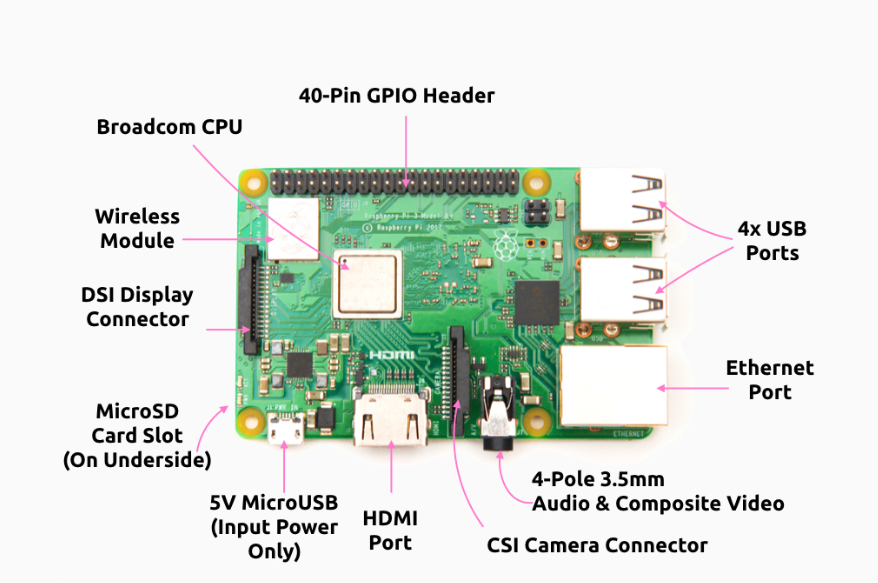
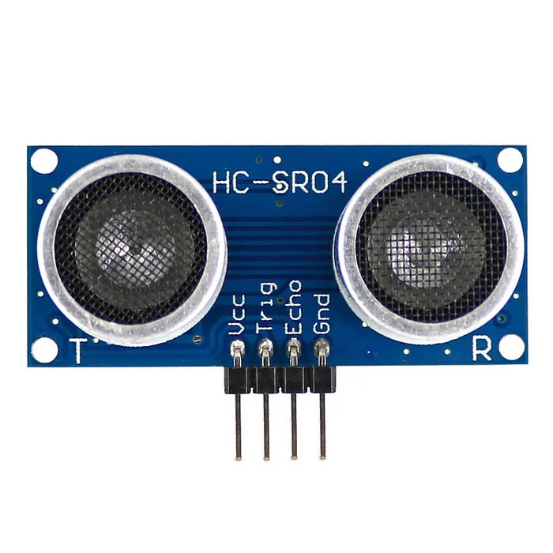
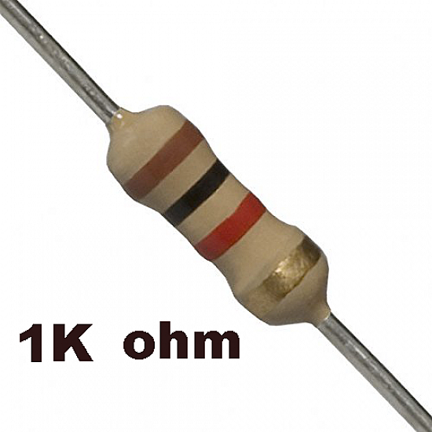
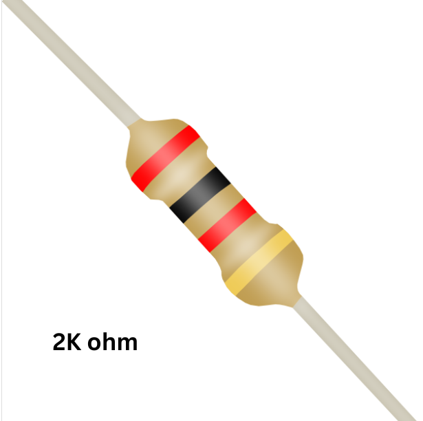

### **Theory**

This simulation demonstrates how to interface an **HC-SR04 Ultrasonic Sensor** with a **Raspberry Pi 4** to measure distances without physical contact. The setup uses Python programming to trigger the sensor and read the echo signal. The time taken for the sound wave to bounce back is used to calculate the distance.

#### Components 

##### 1. Raspberry Pi 4 Model B
The **Raspberry Pi 4** is a powerful single-board computer with **GPIO (General Purpose Input/Output)** pins. It supports Python and allows hardware interfacing with various sensors and components.
   

##### 2. HC-SR04 Ultrasonic Sensor

The **HC-SR04** sensor measures distance by emitting and receiving ultrasonic waves. It calculates the time taken for the waves to return after bouncing off an object and uses this to compute the distance.

It has **four pins**, each with a specific function:

- **VCC**: Power supply pin. Connect to **5V** on the Raspberry Pi.
- **Trig (Trigger)**: Input pin. Sends a short pulse (usually 10µs) to **trigger** the ultrasonic burst.
- **Echo**: Output pin. Goes high (5V) for the duration the sound wave takes to travel to the object and back. This pulse width is used to calculate the distance.
- **GND**: Ground. Connect to **GND** on the Raspberry Pi.

 
 ##### 3. Resistors (1kΩ and 2kΩ)

The **1kΩ (R1)** and **2kΩ (R2)** resistors are used to build a **voltage divider** circuit, which reduces the 5V signal from the Echo pin of the HC-SR04 sensor down to approximately 3.3V—safe for the Raspberry Pi's GPIO pins.

- **1kΩ Resistor (R1)**: Connected between the Echo pin of the sensor and the point where the GPIO input wire and R2 meet. It helps reduce the voltage in proportion with R2.

- **2kΩ Resistor (R2)**: Connected between the GPIO pin and Ground (GND). It completes the voltage divider and sets the output voltage level.

The output voltage at the junction of these resistors is calculated using the voltage divider formula:

> **Vout = Vin × (R2 / (R1 + R2))**  
> **Vout = 5V × (2kΩ / (1kΩ + 2kΩ)) = 5V × (2/3) ≈ 3.3V**

This setup ensures that the Raspberry Pi receives a safe logic-level signal without damaging its GPIO pin.

5. The distance is calculated using the speed of sound (343 m/s).

#### Distance Calculation Formula
\[
\text{Distance} = \frac{\text{Pulse Duration} \times 34300}{2}
\]
- `Pulse Duration` is in seconds  
- `34300 cm/s` is the speed of sound  
- Dividing by 2 accounts for the wave traveling to the object and back

#### Sensor Specifications

- **Operating Voltage:** 5V  
- **Measuring Range:** 2 cm to 400 cm  
- **Accuracy:** ±3 mm  
- **Operating Frequency:** 40 kHz  
- **Pins:** VCC, GND, Trig, Echo

#### Purpose of Each Connection

- Connect the **VCC pin** of the Ultrasonic Sensor to the **5V power pin** of the Raspberry Pi to power the sensor.  
- Connect the **GND pin** of the sensor to a **GND pin** on the Raspberry Pi to complete the circuit.  
- Connect the **Trig pin** of the sensor to **GPIO 18** of the Raspberry Pi to trigger the ultrasonic pulse.  
- Connect the **Echo pin** to **GPIO 24**, but **through a voltage divider** to reduce 5V to 3.3V.  
- Use a **1kΩ resistor** between the Echo pin and GPIO 24.  
- Connect a **2kΩ resistor** from the junction (between 1kΩ and GPIO 24) to **GND** to complete the voltage divider circuit.

#### Why Use a Voltage Divider?

The **Echo pin** outputs **5V**, while the Raspberry Pi’s GPIO pins accept only **3.3V**. Direct connection can damage the board. To safely read the signal, a **voltage divider** using **1kΩ and 2kΩ resistors** reduces the voltage to around **3.3V**, making it safe for the Pi to read the input.
